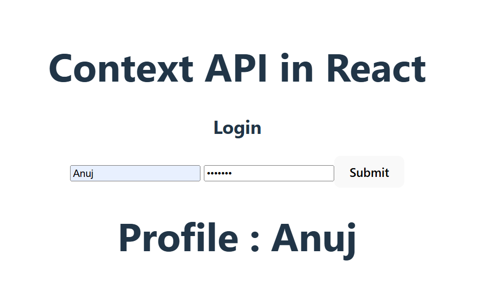

#  React Context API Example

This project demonstrates how to use **React Context API** to manage global state in a simple login/profile app. It avoids prop drilling by sharing data across components using `useContext`.

---

## ⚡ Features

- 🔑 Login form updates global user state  
- 👤 Profile page consumes user data from Context  
- 🚫 No prop drilling needed  
- 🎨 Styled with **Tailwind CSS**  

---

## 📸 Screenshot

<p align="center">
  
</p>

---

## 🚀 Installation

```bash
# 1️⃣ Clone the Repository
git clone https://github.com/anuj-singal/context-api-example.git
cd context-api-example

# 2️⃣ Install Dependencies
npm install

# 3️⃣ Run the Development Server
npm run dev
# Open your browser at 👉 http://localhost:5173
```

---

## 📜 License & Copyright

This project is licensed under the terms of the **MIT License**.  
© 2025 Anuj Singal. All rights reserved.

--- 

## 👨‍💻 Author

[](https://github.com/anuj-singal)

---
